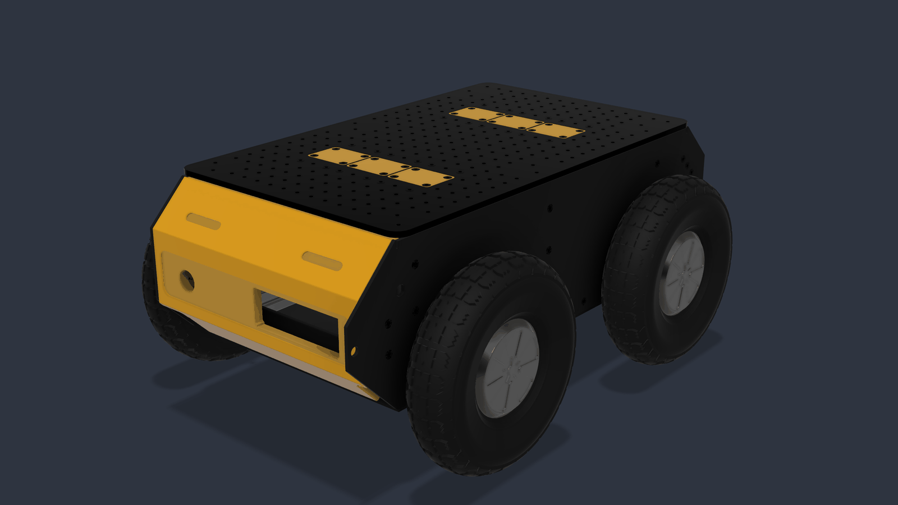
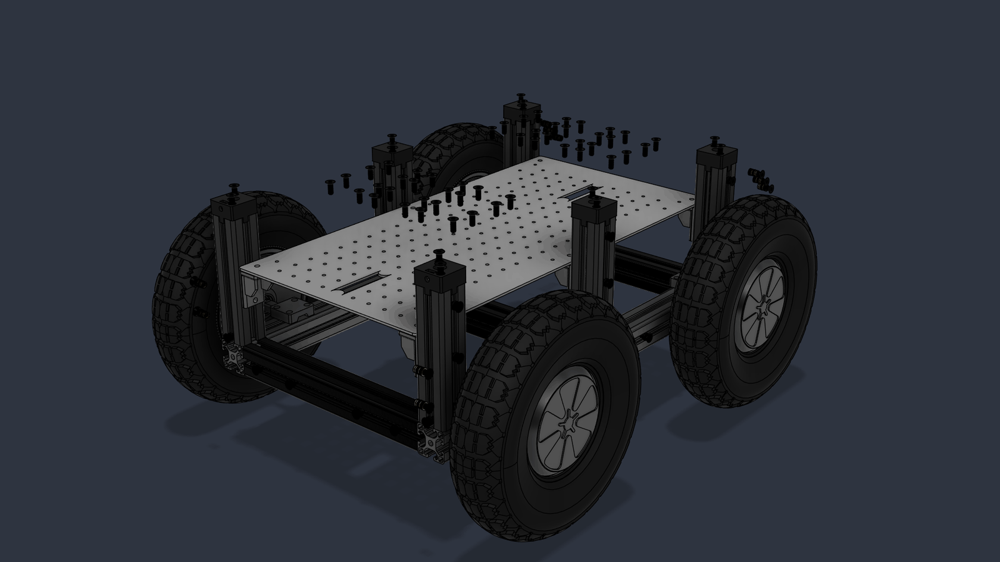
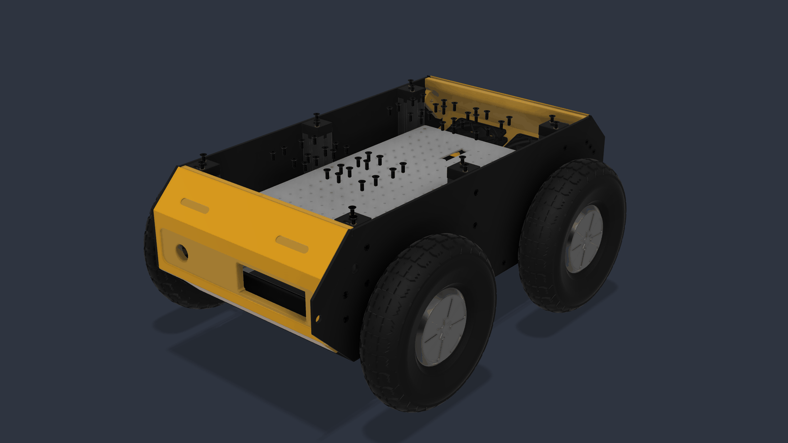
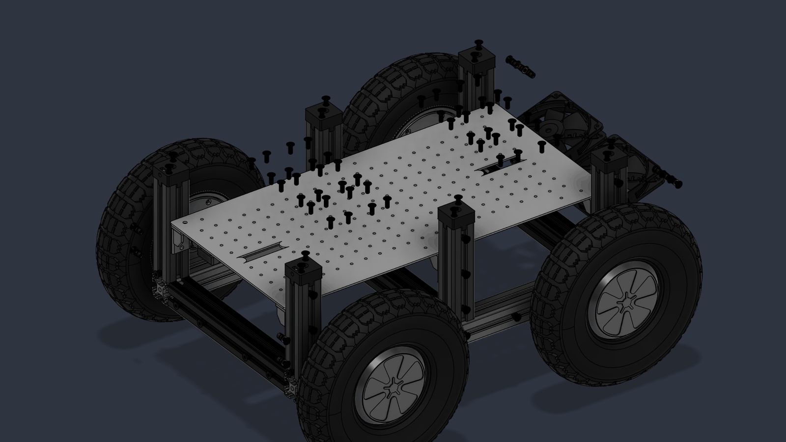
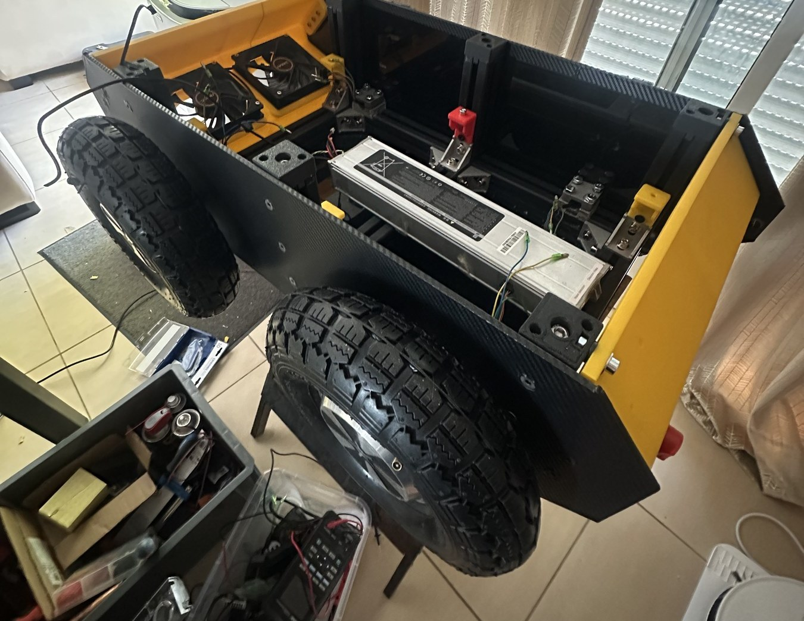
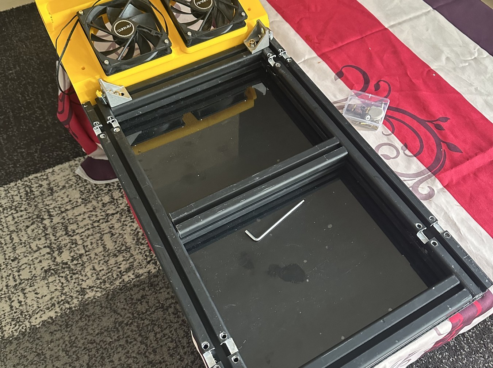

<div align="center">

# Retriever

**Open source autonomous outdoor mobile robot**

[](LICENSE)
[](LICENSE-HARDWARE.txt)
[](https://docs.ros.org/en/jazzy/)
[](#status)



</div>

---

## What this is

Retriever is a four wheel drive outdoor mobile robot, built independently and
released as open hardware. Its single objective is autonomous outdoor
navigation using ROS 2 Jazzy and the Nav2 stack, on a chassis that anyone can
reproduce from documented, commodity parts.

The project is an open rebuild inspired by the [Clearpath
Husky](https://clearpathrobotics.com/husky-a300-unmanned-ground-vehicle-robot/),
a research platform that has become a reference in mobile robotics
laboratories. The Husky is an excellent machine and a commercial product priced
accordingly. Retriever asks a different question: how much of that capability
can be reached by one person, from recovered and off the shelf components, if
the engineering is done properly rather than cheaply?

What makes the project unusual is not the hardware, which is deliberately
ordinary. It is the discipline applied to it: a complete architecture dossier
written before the first part was cut, a documented failure mode analysis, a
hardware safety chain that no software can override, and a build plan with a
measurable exit criterion at every stage.

## Status

| Stage | Exit criterion | State |
|:-----:|----------------|-------|
| 1 | Architecture and CAD design complete | done |
| 2 | Chassis fabricated and assembled | **current** |
| 3 | Power chain energised, no motor connected | next |
| 4 | Motors driven, wheels raised, all stop tests pass | planned |
| 5 | Autonomous outdoor navigation to a waypoint | planned |

Beyond stage 5, the intention is to mount a [Niryo
One](https://github.com/NiryoRobotics/niryo_one) arm on Retriever and turn the
platform into a mobile manipulator.

<div align="center">



</div>

### The same thing, built

<div align="center">


</div>

## Three design decisions

**A CAN bus, not USB, carries every command.** Four BLDC controllers chopping
tens of amps within 30 cm of the signal wiring make USB the wrong choice for
the control path: it is a master slave bus, dynamically enumerated, with no
frame priority. CAN 2.0A at 500 kbit/s links the computer to every
microcontroller instead. USB is retained only for high bandwidth perception
sensors, whose loss degrades the mission but cannot cause dangerous motion.

**The main computer never does real time.** It runs perception, localisation,
Nav2 and the mission state machine, and it produces setpoints. A dedicated
safety microcontroller decides whether those setpoints may be executed. The
computer requests arming; the safety controller grants or refuses it. A ROS 2
bug, an out of memory kill or a blocked kernel cannot produce movement.

**Safety is hardware, and independent of software.** Six stop levels, from a
100 ms software collision monitor down to a mechanically latching emergency
stop wired in series with the main DC contactor coil. The last two levels
contain no code at all.

```
N1  ROS 2 collision monitor and cmd_vel timeout        ~100 ms
N2  ros2_control SystemInterface returns ERROR          ~50 ms
N3  ESP32 MOTION, no CAN frame for 150 ms, setpoint 0  ~150 ms
N4  ESP32 SAFETY, overcurrent or lost heartbeat         ~20 ms
N5  HARDWARE LOOP, latching emergency stop              ~10 ms
N6  Manual battery isolator and main fuse
        Only N5 and N6 are independent of all software
```

## Hardware at a glance

| | |
|---|---|
| Configuration | 4WD skid steer, outdoor |
| Structure | Aluminium extrusion frame, laser cut panels, 3D printed mounts |
| Target mass | 35 kg in running order |
| Target speed | 1.5 m/s |
| Drivetrain | 4 x 6.5 inch hub motors, 250 W each |
| Motor drivers | 4 x BLDC controllers, 36 to 48 V |
| Battery | 36 V, 280 Wh lithium ion, 10S3P |
| Endurance | 70 min at 200 W average |
| Compute | x86 SBC, Ubuntu 24.04, ROS 2 Jazzy |
| Real time | 3 x ESP32 on CAN 2.0A, 500 kbit/s |
| Localisation | GNSS, IMU and wheel odometry, dual EKF |
| Navigation | Nav2, collision monitor, twist mux |

## Repository layout

```
docs/
  architecture/     the eight document architecture dossier
  measurements/     results of the bench measurements M1 to M12
  images/           photos and renders
  sponsorship/      the sponsorship dossier
hardware/
  cad/              mechanical design, STEP and STL
  pcb/              board designs, EasyEDA sources and gerbers
  bom/              costed bill of materials
firmware/
  esp32_motion/     motor control loop, 200 Hz
  esp32_safety/     safety state machine, watchdogs, contactor
  protocol/         protocol.yaml and the code generator
ros2_ws/src/
  retriever_bringup/       launch files and system configuration
  retriever_description/   URDF, meshes, physical parameters
  retriever_msgs/          message definitions
  retriever_hardware/      ros2_control SystemInterface over SocketCAN
  retriever_control/       controller configuration
  retriever_navigation/    Nav2 and robot_localization configuration
  retriever_teleop/        manual control and the operator console
```

## Documentation

The architecture dossier was written before construction began. It is in
French; an English summary is planned.

| Document | Contents |
|---|---|
| [00 Index](docs/architecture/00-index-A-B.md) | Summary, assumptions, open questions |
| [01 Electrical](docs/architecture/01-inventaire-electrique.md) | Inventory, power architecture, busbars |
| [02 Comms](docs/architecture/02-comms-esp32-moteurs.md) | CAN bus, ESP32 roles, motors |
| [03 ROS 2](docs/architecture/03-ros2-etats-boot.md) | Node graph, state machine, boot |
| [04 Safety](docs/architecture/04-securite-watchdogs-capteurs.md) | Stop chain, watchdogs, sensors |
| [05 Software](docs/architecture/05-reseau-code-tests-physique.md) | Network, code layout, test strategy |
| [06 BOM](docs/architecture/06-bom-fmea-schema-plan.md) | Bill of materials, FMEA, build plan |
| [07 Operator](docs/architecture/07-interface-operateur.md) | Operator console |

Every claim in these documents carries a marker: verified against a datasheet,
community consensus, to be measured, or an explicit assumption. Nothing gets
wired before the measurements it depends on have been made.

## Supporting the project

Retriever is self funded by a student. Three items stand between the current
platform and autonomous outdoor operation:

- **Printed circuit boards.** Three boards are being designed in EasyEDA: a
  motor driver interface, a safety and power management board, and a CAN
  distribution board.
- **Embedded AI compute.** The current x86 board runs the navigation stack, but
  not the perception outdoor autonomy asks for.
- **An outdoor LiDAR.** The blocking item. The 2D LiDAR on hand is specified for
  indoor use, and direct sunlight saturates its receiver.
- **A depth camera.** The Kinect v2 on hand is blind in daylight and its driver
  has been unmaintained since 2021.

Sponsors get a written and filmed integration tutorial for the sponsored part,
a field test video with honest performance data, attribution on the chassis and
here in this README, and private feedback on how the part behaves on a real
robot before anything is published.

The full sponsorship dossier is in [docs/sponsorship](docs/sponsorship/).
Enquiries welcome: see contact below.

## Credits

Inspired by the Clearpath Husky platform. The mechanical design was modelled
from scratch and the electrical and software architecture designed
independently. Some ROS 2 package conventions follow the open source
[husky/husky](https://github.com/husky/husky) repository, which is published
under BSD 3 Clause. Clearpath Robotics is not affiliated with this project and
does not endorse it.

See [CREDITS.md](CREDITS.md) for the full attribution.

## Licence

Software and firmware are released under the [Apache License 2.0](LICENSE).
Hardware designs, CAD and PCB files are released under the [CERN Open Hardware
Licence Version 2, Strongly Reciprocal](LICENSE-HARDWARE.txt).

## Contact

William Hanczyk, Bordeaux, France
wcontact33@gmail.com
